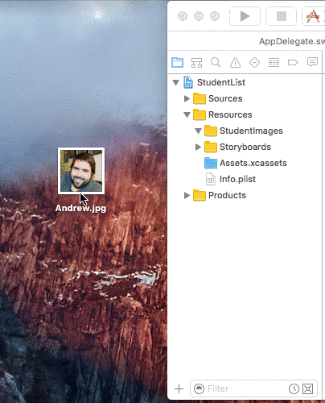

## StudentList

This is a simple app that displays a list of students names. It is used to teach GitHub pull requests.

## How To:

1. Fork this repository to your own GitHub account by clicking the Fork button in the top right corner of the page:

    

2. Clone your fork to your own machine using Tower, GitHub Desktop, or Terminal (your choice).
3. In your local copy of the repo, create a new branch called "add-my-name".
4. Open the StudentList Xcode project.
5. Drag an image of yourself into the StudentList group under Resources. The image name should be your first name (e.g. "Anna.jpg").

    

6. Build and run the app to make sure your image is displayed.
7. Commit your change, including a good, descriptive commit message.
8. Push your changes to your remote repository (on GitHub).
9. On the GitHub page for your repository, select the add-my-name branch, then create a pull request by clicking "Create New Pull Request":

    

10. Enter a description of your pull request, then click "Create pull request".
11. The owner of the repository you forked will have to approve and merge your pull request. After this is done, your change will be in the main repository!
